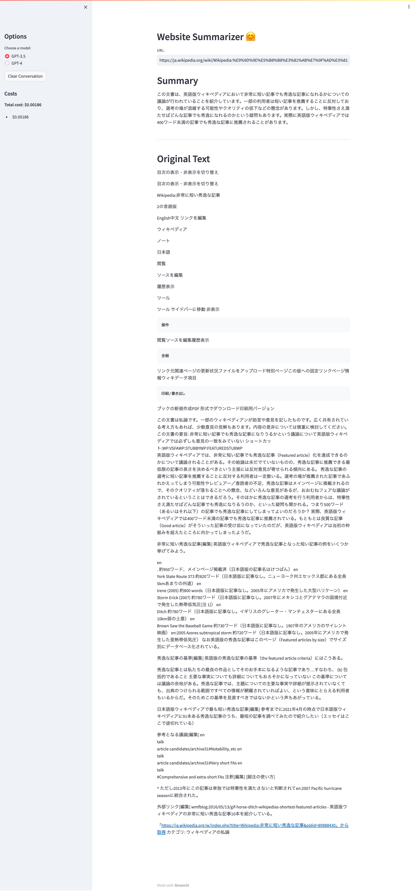

# はじめての AI アプリを作ろう - WEB サイト要約

デプロイは一旦おいておいてローカルでいけるか試す

## この章で学ぶこと

- WEB サイトのコンテンツを取得してそれを ChatGPT API に受け渡す方法を知る
- WEB サイトのコンテンツを要約する方法を知る

## 完成版のコードを見てみる

ライブラリのエラーがでるのでインストールする

```sh
pip install message
```

コマンドエラーになる
stream_chat の方をインストールするのが正しい？

```sh
pip install streamlit_chat
```

正解だった模様

同様に bs4 もインストールする

```sh
pip install bs4
```

インストールできた

動かしてみる

```sh
streamlit run 06_sample_app.py
```

動きました。

サンプルに利用した URL

https://ja.wikipedia.org/wiki/Wikipedia:%E9%9D%9E%E5%B8%B8%E3%81%AB%E7%9F%AD%E3%81%84%E7%A7%80%E9%80%B8%E3%81%AA%E8%A8%98%E4%BA%8B

出力


