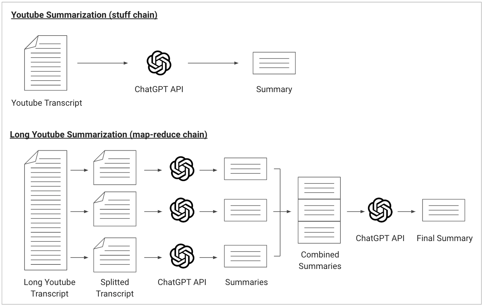

# Youtube 動画の要約をしよう

## この章で学ぶこと

- LangChain の Document Loader の使い方を知る
- LangChain の load_summarize_chain の使い方を知る
- LangChain の PromptTemplete の使い方を知る

## LangChain の便利な機能

- この AI アプリでは、主に以下二つの便利な機能を用いています。
  - Document Loader
  - load_summarize_chain
- まずはこれらの機能の説明を行います。load_summarize_chain については次の章でも引き続き説明を行います。

### Document Loader

LangChain の Document Loader はその名の通り、さまざまなソースからデータを読み込み、言語モデルが処理しやすい標準的な構造(LangChain では Document と呼ばれる)に変換する機能です。

例えば、このアプリでは以下のコードで Youtube 動画の内容(正確には字幕)を取得します。いくつかのライブラリのインストールは必要なものの、ほとんどコードを書くことなく Youtube のコンテンツを Document として取得できます。

### Document とは

Document は、様々なソースから得たデータを言語モデルが解釈しやすい形に構造化するためのデータの型です。Document は主に二つのフィールドから成り立っています。

| key          | 型     | 説明                                                                            |
| :----------- | :----- | :------------------------------------------------------------------------------ |
| page_content | string | ドキュメントの生のテキストデータ                                                |
| metadata     | dict   | テキストに関するメタデータを保存するためのキー/値ストア（ソース URL、著者など） |

Document Loader は、さまざまなデータを読み込み、page_content と metadata を含んだ Document の形式にデータを変換して読み込みます。LangChain では Document をそのまま LLM に渡すことができるように設計されており、データの取り回しが非常に楽になっています。

#### その他 覚えておくべきこと

- Document Loaders には、2 つのメソッドがあります。1 つは load で、
  設定されたソースからドキュメントを丸ごと読み込むもの、
  もう 1 つは load_and_split で、設定されたソースからドキュメントを読み込み、
  テキスト分割器を使用して適切なチャンクサイズに分割するものです。
  読み込んだドキュメントを分割する必要性については次の章で触れます。
- 必要に応じて「Lazy load」を実装することもできます。これにより、メモリにドキュメントを遅延ロードすることができます。
- そのほか、各 Document Loader ごとに細かい設定パラメーターがあるので、都度検索して利用されることをおすすめします。

### load_summarize_chain

次に、以下のコードによって Document Loader が読み込んだデータの要約を行なっています。要約の実行を行うのが load_summarize_chain という機能であり、ここではその内容について細かく説明します。

```py
def summarize(llm, docs):
    prompt_template = """Write a concise Japanese summary of the following transcript of Youtube Video.

{text}

ここから日本語で書いてね。必ず3段落以内の200文字以内で簡潔にまとめること:
"""
    PROMPT = PromptTemplate(template=prompt_template, input_variables=["text"])

    with get_openai_callback() as cb:
        chain = load_summarize_chain(
            llm,  # e.g. ChatOpenAI(temperature=0)
            chain_type="stuff",
            verbose=True,
            prompt=PROMPT
        )
        response = chain({"input_documents": docs}, return_only_outputs=True)
    return response['output_text'], cb.total_cost

document = get_document(url)
if document:
    with st.spinner("ChatGPT is typing ..."):
        output_text, cost = summarize(llm, document)
    st.session_state.costs.append(cost)
else:
    output_text = None
```

### load_summarize_chain とは？

指定された LLM を用いて、与えられた Document のテキストの要約を行う機能です。Document Loader で読み込んだものをそのまま渡せるため、簡潔なコードで要約を実行できて便利です。

```py
chain = load_summarize_chain(
    llm,  # e.g. ChatOpenAI(temperature=0)
    chain_type="stuff",
    verbose=True,
    prompt=PROMPT
)
```

この部分で、load_summarize_chain を呼び出しています。「チェーン」という名が示す通り、この関数は渡された Document に対して要約を実施する一連の処理を自動でおこなってくれます。

ここではまず、llm に ChatGPT のインスタンスを渡します。もちろん、ChatGPT 以外の LLM も利用可能です。次に、使用する要約チェーンのタイプを chain_type で指定します。chain_type は以下 3 つから選択できます。

#### 3 つのチェーンタイプ

| 名前       | 説明                                                                                                                                                                                                                                                                                                                                                                                           |
| :--------- | :--------------------------------------------------------------------------------------------------------------------------------------------------------------------------------------------------------------------------------------------------------------------------------------------------------------------------------------------------------------------------------------------- |
| stuff      | 最も基本的な chain_type で、単一の Document 文書または複数の Document を取り扱うことができます。入力として与えられた文書をそのまま処理し、結果を出力します。このタイプでは、複数の Document が与えられた際に\n\n で連結が行われること以外の特別な処理は何も行われません。                                                                                                                      |
| map_reduce | 複数の Document をまず個別に要約し(Map)、次にそれらの結果を一つにまとめて(Reduce)、全体の要約を生成します。このタイプは、大量の文書を扱い、それらを要約する場合などに有用です。Map ステップでは並列処理が行われるため高速ですが、文書の順序を考慮しないため、用途によっては不適切です。                                                                                                        |
| refine     | 分割されている文書を最初から順番に処理し、要約した文と次の文を併せてまた要約するという方式で、徐々に全体の要約文を生成します。情報の欠落が少ない方法と言われていますが、要約を順番に実行するという特性上、処理が遅く、また map_reduce と比べて劇的に要約の品質が上がる訳でもないらしいので、僕は使ったことがありません。(小説のように話の流れが明確なものだと refine が適切なのかもしれません) |

今回は stuff を利用したシンプルな例としていますが、次の章では map_reduce を利用し、非常に長い動画の要約を実行します。



残り二つのパラメータは以下の通りです。

- verbose： この引数が True に設定されている場合、チェーンは実行中に詳細なログを出力します。(実行中の Prompt の中身を表示する、など、)
- prompt： チェーンが要約を実行するときに利用するプロンプトを PromptTemplete という形式にして指定します。要約対象の文を input_variables=["text"]として渡すのはお作法のようなので天下り的に覚えるのが良いかと思います。

本書では PromptTemplete について詳しい解説を行っていませんが、埋め込む変数のバリデーション、Prompt のファイル保存、FewShot Prompt の自動作成といった便利な機能も備えています。[こちらの記事](https://zenn.dev/umi_mori/books/prompt-engineer/viewer/langchain_prompt)が非常にわかりやすかったので、余裕があれば一読されることをおすすめします。

LangChain では以下の PromptTemplete がのデフォルトで利用されています。Youtube から取得する字幕が英語の場合は text に英語が入ってしまい、Prompt 全文が英語になってしまいます。そのような場合は英語で要約が書かれてしまうため、今回は自分で日本語で作成した Prompt を渡しています。

```py
# load_summarize_chain chan_type==stuff で利用されるprompt
# https://github.com/hwchase17/langchain/blob/master/langchain/chains/summarize/stuff_prompt.py
prompt_template = """Write a concise summary of the following:

"{text}"

CONCISE SUMMARY:"""
PROMPT = PromptTemplate(template=prompt_template, input_variables=["text"])
```

load_summarize_chain を定義した後は、以下のコードで実際に実行しています。入力する Document は input_documents として渡し、return_only_outputs いう引数で、チェーンが各ステップの出力だけを返すように指示しています。各ステップの入力文は返さないという意味であり、map_reduce 方式だと、途中のステップの出力文も返却されます。

```py
response = chain({"input_documents": docs}, return_only_outputs=True)
print(response)
```

> {'output_text': 'アメリカの高等教育において、男女間の格差が拡大していることが指摘されている。女性が男性を追い抜いたのは、1972 年に制定された Title IX 法によって、女性の経済的・教育的機会が拡大したことが原因であった。しかし、現在は男女間の大学卒業率に 18％の差があり、女性が優位に立っている。男性が女性に比べて学業成績が低いのは、脳の発達の遅れや男性教師の不足が原因である。男性教師の存在が、男子生徒にとって重要な役割を果たすことが示されている。男女平等を実現するためには、男性の問題にも目を向ける必要がある。'}

## まとめ & 残課題

細かなエラー処理などは必要なものの、以上の要素を抑えれば、Document Loader を利用して、取得したさまざまなコンテンツを簡単に要約することができると思います。僕も自前の Youtube 動画要約アプリでよく要約を行っており、非常に便利です。ぜひ試してみてください 🤗

ただ、この章で作った Youtube 要約アプリには致命的なエラーがあります。1 時間を超えるような非常に長い動画だと、以下のエラーが出るはずです。これは一度の ChatGPT API 呼び出しに利用可能な token 数を超えたからエラーだよという意味です。

```sh
InvalidRequestError: This model's maximum context length is 4097 tokens.
However, your messages resulted in 23103 tokens.
Please reduce the length of the messages.
```

次の章では chan_type="map_reduce"を利用して、長い動画でも要約が行える実装をご紹介します。

## 動かしてみる

```sh
streamlit run 07_sample_app.py
```

試す動画
https://www.youtube.com/watch?v=vtPPWWygfjo&t=213s
-> ちょっとだけオーバーしてだめだった

https://www.youtube.com/watch?v=OJCP5fT8m5Y&pp=ygUW5YuJ5by35pa55rOVIOWwj-WtpueUnw%3D%3D
-> ひろゆきのやつ -> 要約できた
