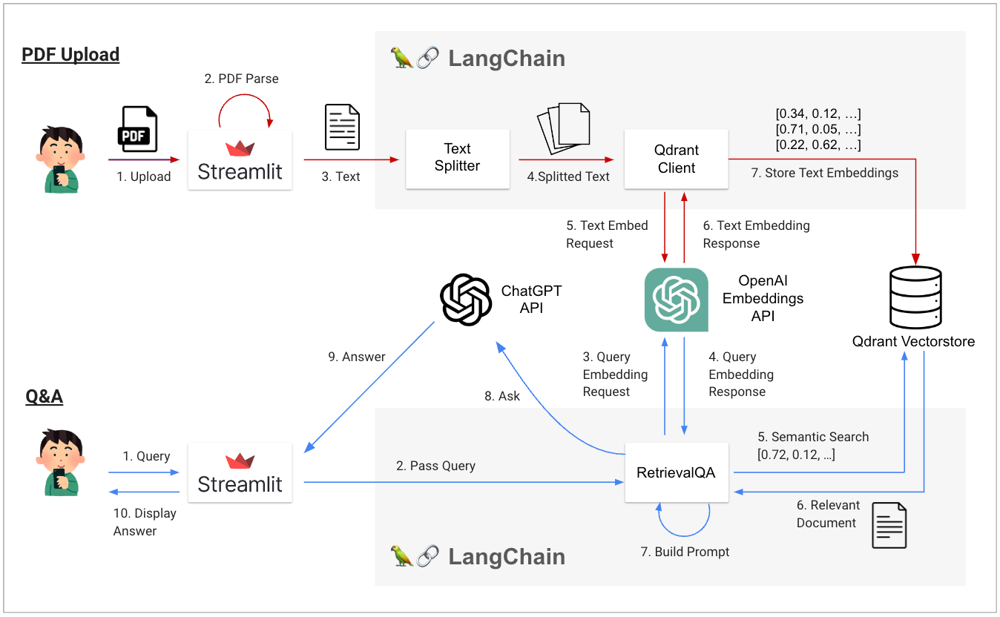
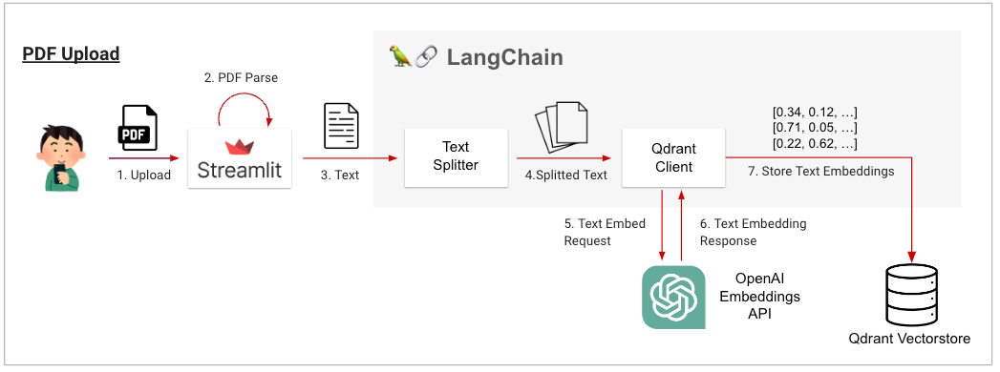
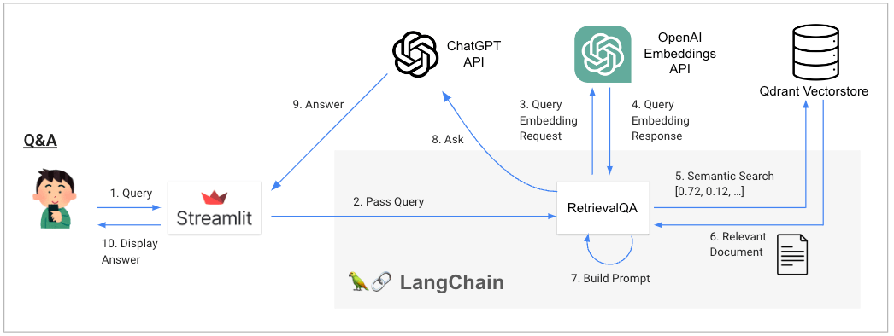

# PDF に質問しよう (前編: PDF Upload & Embedding)

## PDF に質問してみよう

突然ですが、長い論文とか会社の決算説明資料とか読むの面倒ですよね？論文は英語のものが多いし、決算説明会資料とかはどうでもいい内容もとても多いです。

ということで PDF をアップロードして ChatGPT に読ませた上で、その内容を質問できる AI アプリを作ってみましょう。

動画概要図に示す通り、今回のアプリは少し複雑です。そこで今回のアプリでは、この章で"PDF Upload"の部分(赤線の流れ)を作り、次の章で"Q&A"の部分を作ります。



## この章で学ぶこと

- Streamlit でページの切り替えをする方法を知る
- Streamlit のファイルアップローダーとは何かを知る
  - どんなデータをアップロードできるの？
  - 詳細設定ではどんな項目を設定できるの？
- Document Loader をあえて使わずに LangChain にコンテンツを読み込む方法を知る
- LangChain で読み込んだコンテンツを Embedding に変換する方法を知る

## PDF に質問できる仕組み

ChatGPT に読ませて質問をする、と書きました。どのようにそれを実現するのかという説明から始めていきましょう。

ChatGPT は'21/09 までのデータで学習が行われた人工知能です。そのため、最近起こった出来事や、わたしたちが読ませる PDF の内容については知識を持っていないことが多いです。(もちろん、あなたが読ませる PDF が ChatGPT の学習に使われてたなら、ChatGPT がその内容を知っている可能性はありますが…。)

そのため、以下に示す流れで、PDF のデータを DB に格納し、その中から質問に関連する内容を取り出して Prompt に埋め込むことで、ChatGPT がその知識を前提条件として利用しつつ質問に答えることを可能にしましょう。

### PDF に質問するまでの流れ

図を見ながらでないと流れがよくわからないと思うので、冒頭に貼り付けた図を再掲して流れの説明を行います

#### 準備: PDF Upload (赤で記載)



- Streamlit から PDF をアップロードする
- Streamlit が PDF 内のテキストを取得する
- テキストを LangChain に渡す
- Text Splitter でチャンクに分割する
- 各チャンクを OpenAI Embeddings API に渡す
- 各チャンクが Embedding のリストになって返ってくる
- Qdrant Vectorstore(ベクトル DB)に Embedding を保存する

語彙の補足を非常に簡潔に行っておきます

- Embedding: なんらかの方法で数値化され、ベクトル表現になった文字列を Embedding と呼ぶことが多いです。(詳細は Google 検索したり、ChatGPT に聞いてみてください。)
- Vectorstore: Embedding を格納して検索可能にしたデータベースを Vectorstore やベクトル DB と呼ぶことが多いです。本書ではベクトル DB の表記で統一します。

#### 質問応答: Q&A (青で記載)



- ユーザーが Streamlit に質問(Query)を書く。
- Streamlit が質問を LangChain に渡す
- 質問を OpenAI Embeddings API に渡す
- Embedding になった質問が返ってくる
- 4.で得た Embedding をもとにベクトル DB から似た文書(チャンク)を検索する (関連文脈をセマンティック検索しているのと同義)
- ベクトル DB から似た文書が返ってくる
- 6.で得た内容を Prompt に代入して Prompt を作成
- ChatGPT API に Prompt を投げて質問を行う
- ChatGPT API が回答を返してくる
- Streamlit で回答を表示する

10 ステップもあるのですが、これでも内容を端折っています。大変ですね。少しだけ補足しておきます。

- セマンティック検索
  - 通常はの質問(Query)の Embedding と文書(チャンク)の Embedding のコサイン類似度などで類似度を計算します。
  - LLM を活用したアプリでは当たり前のようにセマンティック検索が用いられていますが、個人的にはこれは過剰な Embedding 依存であり、個人的にはいわゆる"普通の検索"も併用すべきだと結構強く思っています。
- Prompt
  - 以下のような Prompt を組み立てて ChatGPT に回答を考えさせています
  - ここでは概説のために Prompt の"イメージ"を日本語で書いています。実際には後述する英語の Prompt を用います。

```py
prompt_template = f"""
以下の前提知識を用いて、ユーザーからの質問に答えてください。

==========
前提知識
・{DBから取ってきた関連知識-1}
・{DBから取ってきた関連知識-2}
・{DBから取ってきた関連知識-3}

==========
ユーザーからの質問
・{ユーザーからの質問}
"""
```

```py
# prompt の例
"""
以下の前提知識を用いて、ユーザーからの質問に答えてください。

==========
前提知識
・大谷翔平選手の2023年6月23日時点のHR数は24本です
・大谷翔平選手の2023年6月23日時点の勝利数は6です
・大谷選手の身長は193cmです

==========
ユーザーからの質問
・大谷翔平選手の2023年の選手成績を教えてください
"""

# >> 大谷翔平選手は野手として24本のホームランを記録しており、投手としては6勝をあげています
```

ベクトル DB の準備や質問応答処理は自分で実装するととても大変です。しかし LangChain と驚くほど少ない行数で実現することが可能です。動画要約の章でも軽く触れましたが、あまりにも処理が隠蔽されているので気持ち悪さはあります笑。

とはいえ、説明する内容は少なくありません。そこで、まずは本章で準備のフェーズの実装内容を説明し、次章で実際の質疑応答に進みます。

では、早速始めていきましょう

## PDF アップロードページを作ろう

### 複数ページの切り替えを可能にしよう

まずは PDF をアップロードするページを作ってみましょう。このページで PDF をアップロードして、その後、Ask My PDF(s)ページに移動して質問を投げます。

(注記: 質問をするページと同じページで PDF のアップロードをしても良いのですが、Streamlit でのページ切替を学ぶ題材として作っています 😇)

Streamlit のページの切り替えは以下の実装で実現します。各ページの実装内容が大きくなる場合は Multipage App という機能を用いて、複数の Python ファイルに各ページの実装を分割して書いて利用することも可能ですが、本書では一旦この機能は利用しません。

`09_my_app.py`

```py
import streamlit as st

def init_page():
    st.set_page_config(
        page_title="Ask My PDF(s)",
        page_icon="🤗"
    )
    st.sidebar.title("Nav")
    st.session_state.costs = []

def page_pdf_upload_and_build_vector_db():
    # ここにPDFアップロードページの実装をする
    st.write('アップロードページ')

def page_ask_my_pdf():
    # ここにChatGPTに質問を投げるページの実装をする
    st.write('ChatGPTに質問を投げるページ')

def main():
    init_page()

    # ページ切り替えを実装
    selection = st.sidebar.radio("Go to", ["PDF Upload", "Ask My PDF(s)"])
    if selection == "PDF Upload":
        # ここにPDFアップロードページの実装をする
        page_pdf_upload_and_build_vector_db()
    elif selection == "Ask My PDF(s)":
        # ここにChatGPTに質問を投げるページの実装をする
        page_ask_my_pdf()

    # コストの計算結果をサイドバーに表示する
    costs = st.session_state.get('costs', [])
    st.sidebar.markdown("## Costs")
    st.sidebar.markdown(f"**Total cost: ${sum(costs):.5f}**")
    for cost in costs:
        st.sidebar.markdown(f"- ${cost:.5f}")

if __name__ == '__main__':
    main()
```

```sh
streamlit run 09_my_app.py
```

## PDF アップロード機能をつけて読み取ろう

Streamlit ではファイルアップローダー機能を用いて、さまざまなファイルを読み込むことができます。今回の AI アプリでは、以下の流れで PDF ファイルを読み込んでいます。

- PDF をアップロード
- PyPDF2 ライブラリの PdfReader を利用して PDF ファイルの読み取り
- その後、RecursiveCharacterTextSplitter を利用し token 数を基準にチャンク分割

LangChain の Document Loader に準備されている PDF Loader を利用しても構いません(参照: [LangChain PDF](https://python.langchain.com/docs/modules/data_connection/document_loaders/how_to/pdf))。PDF ファイルの読み取りは意外と大変で、LangChain の Loader では対応できていないような細かい処理が必要なことも多いと思うので、ここでは Document Loader を利用しない書き方をしました。

余談ですが LangChain の Document Loader は「とりあえず実装しました」というノリの機能が多く、細かいことに気配りが足りないことも稀に良くあります。そのため"よく枯れている"(長い間使い込まれて気配りが行き届いている)ライブラリを利用するのはとても良い選択だと思います。

実際のコードは以下のようになります

```py
# pip install PyPDF2
from PyPDF2 import PdfReader

def get_pdf_text():
    uploaded_file = st.file_uploader(
        label='Upload your PDF here😇',
        type='pdf'  # アップロードを許可する拡張子 (複数設定可)
    )
    if uploaded_file:
        pdf_reader = PdfReader(uploaded_file)
        text = '\n\n'.join([page.extract_text() for page in pdf_reader.pages])
        text_splitter = RecursiveCharacterTextSplitter.from_tiktoken_encoder(
            model_name=st.session_state.emb_model_name,
            # 適切な chunk size は質問対象のPDFによって変わるため調整が必要
            # 大きくしすぎると質問回答時に色々な箇所の情報を参照することができない
            # 逆に小さすぎると一つのchunkに十分なサイズの文脈が入らない
            chunk_size=250,
            chunk_overlap=0,
        )
        return text_splitter.split_text(text)
    else:
        return None
```

file_uploader は [Streamlit 公式ドキュメント](https://docs.streamlit.io/library/api-reference/widgets/st.file_uploader)に記載のパラメーターで挙動をコントロールすることができます。長くなるので折りたたんでおきますが、アップロードを許可する拡張子を type や複数ファイルのアップロードを許可する accept_multiple_files などは覚えておいて損はないと思います。

###### file_uploader で設定可能なパラメータ

| プロパティ名          | 説明                                                                                                                             |
| :-------------------- | :------------------------------------------------------------------------------------------------------------------------------- |
| label                 | ファイルアップローダーが何のために使われるのかを説明する短いラベル。ラベルには Markdown や絵文字などを含めることも可能です。     |
| type                  | 許可される拡張子の配列。デフォルトは None で、すべての拡張子が許可されます。                                                     |
| accept_multiple_files | True の場合、ユーザーは複数のファイルを同時にアップロードすることができます。デフォルトは False です。                           |
| key                   | ウィジェットの一意のキーとして使用する任意の文字列または整数。                                                                   |
| help                  | ファイルアップローダーの隣に表示されるツールチップ。                                                                             |
| on_change             | ファイルアップローダーの値が変更されたときに呼び出されるオプションのコールバック。                                               |
| disabled              | ファイルアップローダーを無効にするためのオプションのブール値。デフォルトは False です。                                          |
| label_visibility      | ラベルの可視性。hidden の場合、ラベルは表示されませんが、ウィジェットの上には空のスペースが残ります。デフォルトは visible です。 |

また、デフォルトではアップロードされるファイルのサイズは 200MB までですが、この設定は Streamlit のカスタム設定で説明した server.maxUploadSize 設定オプションで変更可能です。(第 5 章 "AI チャットアプリをデプロイしよう"の末尾をご参照ください。)

`09_my_app.py`

```py
import streamlit as st
from PyPDF2 import PdfReader
from langchain.text_splitter import RecursiveCharacterTextSplitter

def init_page():
    st.set_page_config(
        page_title="Ask My PDF(s)",
        page_icon="🤗"
    )
    st.sidebar.title("Nav")
    st.session_state.costs = []

# PDFの取得
def get_pdf_text():
    uploaded_file = st.file_uploader(
        label='Upload your PDF here😇',
        type='pdf'  # アップロードを許可する拡張子 (複数設定可)
    )
    if uploaded_file:
        pdf_reader = PdfReader(uploaded_file)
        text = '\n\n'.join([page.extract_text() for page in pdf_reader.pages])
        text_splitter = RecursiveCharacterTextSplitter.from_tiktoken_encoder(
            model_name=st.session_state.emb_model_name,
            # 適切な chunk size は質問対象のPDFによって変わるため調整が必要
            # 大きくしすぎると質問回答時に色々な箇所の情報を参照することができない
            # 逆に小さすぎると一つのchunkに十分なサイズの文脈が入らない
            chunk_size=250,
            chunk_overlap=0,
        )
        return text_splitter.split_text(text)
    else:
        return None

def page_pdf_upload_and_build_vector_db():
    # ここにPDFアップロードページの実装をする
    st.write('アップロードページ')

def page_ask_my_pdf():
    # ここにChatGPTに質問を投げるページの実装をする
    st.write('ChatGPTに質問を投げるページ')

def main():
    init_page()

    # ページ切り替えを実装
    selection = st.sidebar.radio("Go to", ["PDF Upload", "Ask My PDF(s)"])
    if selection == "PDF Upload":
        # ここにPDFアップロードページの実装をする
        page_pdf_upload_and_build_vector_db()
    elif selection == "Ask My PDF(s)":
        # ここにChatGPTに質問を投げるページの実装をする
        page_ask_my_pdf()

    # コストの計算結果をサイドバーに表示する
    costs = st.session_state.get('costs', [])
    st.sidebar.markdown("## Costs")
    st.sidebar.markdown(f"**Total cost: ${sum(costs):.5f}**")
    for cost in costs:
        st.sidebar.markdown(f"- ${cost:.5f}")

if __name__ == '__main__':
    main()

```

### 読み取ったテキストを Embedding にしよう

さて、PDF からテキストを抜き出すことができました。次は、テキストを数値化して、Embedding(ベクトル)にしましょう。

Embedding について詳しくない方向けには、折りたたみの中に少し説明を書いておきました。わかりづらいかもしれないので、その場合は ChatGPT に聞いたり、Google 検索してみてください。

##### Embedding とは？

Embedding とは、単語やフレーズを数値ベクトル（連続した数値のリスト）として表現することを指します。Embedding とは英語で「埋め込み」という意味です。

なぜ「埋め込み」なのかというと、単語やフレーズを数値化してベクトルにすることは、高次元空間に「埋め込む」ということと意味的には等しいからだそうです。

最初は何言ってるかイメージできないと思いますが、単語やフレーズを何らかの手法によってベクトル化(Embedding 化)した後の結果、もしくはその手法のことだとざっくり認識しておけばいいと思います。

ここで「何らかの手法」と書いたのは理由があります。単語やフレーズを数値化する手法というのは、LLM が登場するずっと前から存在しています。本書を読まれる方は Word2vec という手法に聞き覚えがあるかもしれません。「王様 - 男性 + 女性 = 女王」で有名なやつです。あれは、word2vec という手法を用いて"王様"や"女王"のベクトルを計算し、ベクトル同士で加減算を行ってみるとこのような結果が得られたよ、という手法でした。

Word2Vec は比較的最近の手法であり、もっと原始的な Embedding 化の方法としては BoW (Bag of words)というものもあります。ものすごく大きなベクトルを準備し、各次元に単語を割り当て、文章中に出てきた単語の次元に 1 を入れ、出てこなかったら 0 を割り当てる、というものです。

Embedding 化の手法は非常に多くありその全てを把握する必要は全くありません。文書を Embedding 化することで、その類似度が計算できるようになり、機械が自由自在に言葉を扱えるようになるということだけ覚えていれば十分かと思います。

#### OpenAI Embeddings API を用いたテキストの Embedding 化

今回のサンプルアプリでは OpenAI が公開している Embeddings API を利用してテキストの Embedding を生成します。これは LangChain の OpenAIEmbeddings モデルを利用すれば簡単に利用できます。

実際にはこの処理が LangChain の他の機能の裏側で走るため、実装方法を知らなくても大丈夫ですが、何が起こっているか理解しておいた方がいいので紹介しておきます。

```py
from langchain.embeddings import OpenAIEmbeddings

emb_model = OpenAIEmbeddings()
text = "こんにちは世界！"
result = emb_model.embed_documents([text])  # listで入れる必要があるので注意
print(f'Embeddingの次元数: {len(result[0])}')
print(result[0][:5])
```

> Embedding の次元数: 1536
> [-0.00016437806430522268, -0.004714747243995943, -0.003478196315921736, -0.011274809515844784, -0.007539791230954652]

#### ベクトル DB への Embedding の保存

次に、作った Embedding をベクトル DB に格納します。ベクトル DB に格納することで、あるテキストを Embedding にした際に、その Embedding の類似の Embedding (すなわち類似文書) を高速に検索できます。

ベクトル DB は群雄割拠の様相を呈しており、さまざまな選択肢があります。有名なものは以下の通りです。

| 名前     | 簡単な説明 (≒ 筆者の印象)                                                                                                                                                                                                 |
| :------- | :------------------------------------------------------------------------------------------------------------------------------------------------------------------------------------------------------------------------ |
| Faiss    | Meta 社(facebook)謹製のベクトル DB。IT/WEB 業界では非常に広く使われている。検索パフォーマンスは良好なものの、シンプルすぎて少し扱いづらいのと、めぼしいホスティングサービスがないので初心者には少し扱いづらいかも。       |
| Pinecone | LangChain で Embedding を用いる例でよく登場するベクトル DB。サンプルも多くコードもシンプルで扱いやすそう。クラウドサービス上でしか扱えないので UI 操作するのがちょっと面倒くさい。                                        |
| Chromia  | 最近すごい伸びてる印象があるベクトル DB。Pinecone と並んでよくサンプルアプリに登場する気がする。'23/7 時点ではまだクラウドサービスがないのでホスティングが難しい(?)。開発ロードマップには載っているので、その出来に期待。 |
| Qdrant   | 今回利用するベクトル DB                                                                                                                                                                                                   |

[【LLM】ベクトルデータベースって多くてどれを使ったら良いか分からないというあなたのための記事（6 つのツールを比較）](https://zenn.dev/moekidev/articles/9e8b85025d590e)という記事も参考になるかと思います。

今回は[Qdrant](https://python.langchain.com/docs/modules/data_connection/vectorstores/integrations/qdrant)を利用します。ローカル開発環境、フルマネージドクラウドサービス(Qdrant Cloud)、その他自前のサーバー(On-premise, AWS, GCP etc,)にベクトル DB を保存できる上に、ローカル開発環境で利用したコードをほぼ変更せずにクラウドのフルマネージドサービスで利用できて便利です。

とはいえ、正直な話をすると、サンプルアプリの説明のしやすさで Qdrant を選定した面は否めません。実際に AI アプリを大掛かりに開発される場合は、利用される環境や各種制約条件に応じて適切な技術スタックを選定していただけると幸いです。

### Embedding への変換と保存

さて、ここからは実際に PDF から読み取ったテキストをどのように Embedding にして、ベクトル DB に保存するのかを見ていきましょう。以下の 2 つのステップを実行しているコードをまずは提示します。

- load_qdrant 関数: ベクトル DB を操作するクライアントを準備する
- build_vector_store 関数: PDF のテキストを Embedding にしてベクトル DB に保存する

```py
from qdrant_client import QdrantClient
from langchain.vectorstores import Qdrant
from langchain.embeddings.openai import OpenAIEmbeddings

QDRANT_PATH = "./local_qdrant"
COLLECTION_NAME　= "my_collection"

def load_qdrant():
    client = QdrantClient(path=QDRANT_PATH)

    # すべてのコレクション名を取得
    collections = client.get_collections().collections
    collection_names = [collection.name for collection in collections]

    # コレクションが存在しなければ作成
    if COLLECTION_NAME not in collection_names:
        # コレクションが存在しない場合、新しく作成します
        client.create_collection(
            collection_name=COLLECTION_NAME,
            vectors_config=VectorParams(size=1536, distance=Distance.COSINE),
        )
        print('collection created')

    return Qdrant(
        client=client,
        collection_name=COLLECTION_NAME,
        embeddings=OpenAIEmbeddings()
    )

def build_vector_store(pdf_text):
    qdrant = load_qdrant()
    qdrant.add_texts(pdf_text)

def page_pdf_upload_and_build_vector_db():
    st.title("PDF Upload")
    container = st.container()
    with container:
        # さっき作ったもの
        pdf_text = get_pdf_text()
        if pdf_text:
            with st.spinner("Loading PDF ..."):
                build_vector_store(pdf_text)

page_pdf_upload_and_build_vector_db()
```

各ステップについて簡単な説明を書いておきます。

#### ベクトル DB を操作するクライアントを準備する

load_qdrant 関数では、まず、qdrant_client([ref](https://github.com/qdrant/qdrant-client))ライブラリを用いて、ベクトル DB を操作するクライアントを準備します。

ベクトル DB の保存場所はローカルファイルシステム、メモリ、フルマネージドクラウドサービス(Qdrant Cloud)、各種 On-premise(自社サーバー, AWS, GCP など)から選択でき、path に設定することで簡単に切り替えが可能です。

次の章では、ベクトル DB をクラウドに保存する方法を紹介しますが、path を url に切り替えて、API_KEY も併せて渡すだけなので非常に簡単です。(Qdrant Cloud の無料会員登録は必要です)

```py
from qdrant_client import QdrantClient

# ローカルへの保存
client = QdrantClient(path="./local_qdrant")

# qdrant cloud への保存 (次の章で詳しく話します)
client = QdrantClient(
    url="https://oreno-qdrant-db.us-east-1-0.aws.cloud.qdrant.io:6333",
    api_key="api-key-hoge123fuga456"
)
```

この章では、まずはローカルファイルシステムに保存するように設定して、動作確認を行ないます。

Collection(DB のテーブルみたいなもの)がまだ存在しなければ作成しています。この箇所についてはあまり AI アプリにとって本質的ではないので詳細な説明は省きます。

```py
# すべてのコレクション名を取得
collections = client.get_collections().collections
collection_names = [collection.name for collection in collections]

# コレクションが存在しなければ作成
if COLLECTION_NAME not in collection_names:
    # コレクションが存在しない場合、新しく作成します
    client.create_collection(
        collection_name=COLLECTION_NAME,
        vectors_config=VectorParams(size=1536, distance=Distance.COSINE),
    )
    print('collection created')
```

次に Qdrant の設定を行います。ややこしいのですが、これは langchain.vectorstores の機能の一つで、Qdrant のベクトル DB を利用して、以下の作業を行なってくれる便利なクラスです。

- 与えられたテキストや Document の内容を embeddings で与えたモデルを用いて Embedding 化する
- ベクトル DB のクライアント(client)を用いて、生成した Embedding をベクトル DB の collection_name に保管する

```py
def load_qdrant():
    ...
    return Qdrant(  # ここの話です
        client=client,
        collection_name=COLLECTION_NAME,
        embeddings=OpenAIEmbeddings()
    )

# 後段で使う部分も載せてあります
def build_vector_store(pdf_text):
    qdrant = load_qdrant()
    qdrant.add_texts(pdf_text)
```

前述の通り、今回のアプリでは LangChain の OpenAIEmbeddings()を介して OpenAI Embeddings API を利用します。

OpenAI Embeddings API は有料なので、テキストの Embedding 処理が発生する際にコストが発生するのでご注意ください。(今回のサンプルアプリでは「PDF のテキストをベクトル DB に保存するとき」「質問を投げるとき」の 2 か所で費用が発生します)

Embeddings API は'23/6 に従来の 1/4 の値段に大幅値下げされており非常に安価に利用可能です。(参考: [Function calling and other API updates (2023/06/13)](https://openai.com/blog/function-calling-and-other-api-updates))

よっぽどヘビーユースしない限りはほぼ無料と言ってもいいレベルのコストしか発生しませんが、どうしても無料のまま使いたい方は embeddings に Huggingface のモデルを設定して完全無料にすることも可能です。

PDF を読み込む際に利用する Embedding のモデルと、質問を投げるときに利用する Embeddings のモデルは同じものを利用する必要があるので、その点はご注意ください。

#### PDF のテキストを Embedding 化してベクトル DB に保存する

```py
def build_vector_store(pdf_text):
    qdrant = load_qdrant()
    qdrant.add_texts(pdf_text)
```

クライアントでほとんどの処理が隠蔽されているため、qdrant.add_texts(pdf_text)の 1 行のみで、与えたテキストの Embedding 化とベクトル DB への保存が実行されます。素晴らしいですね。

ちなみに、LangChain のベクトル DB の作成を以下のように書いている記事や本をご覧になることもあるかもしれません。

```py
# LangChain の Document Loader を利用した場合は `from_documents` にする
Qdrant.from_texts(
    pdf_text,
    OpenAIEmbeddings(),
    path="./local_qdrant",
    collection_name="my_documents",
)
```

Qdrant の場合、クライアントは毎回保存先の内容を破壊してゼロから作り直します。
用途によっては、このような書き方の方がシンプルでいいかもしれません。
(ベクトル DB を提供するサービスによって、from_document などの挙動が違うようなので、都度仕様を確認されることをおすすめします。)

#### ベクトル DB に保管されたことの確認

ローカルファイルシステムのベクトル DB の実態は SQLite です。そのため、Embedding が保管されたかどうかの確認は以下のような方法で可能です。

```sh
% sqlite3 collection/my_documents/storage.sqlite
SQLite version 3.38.2 2022-03-26 13:51:10
Enter ".help" for usage hints.
sqlite> .tables
points
sqlite> .schema points
CREATE TABLE points (id TEXT PRIMARY KEY, point BLOB);
sqlite> select * from points;
gASVJAAAAAAAAACMIDNkYmExYjYwZTJiYjQzMGM5NmI0YzJjNWJlMTBlMDU4lC4=|��V8
gASVJAAAAAAAAACMIDY4NjdmMzY5MDYxNjQ2NzJhNGRmNTVkNDY1NThjNjNmlC4=|���9
gASVJAAAAAAAAACMIDY5OWYzZWRhODc3YjRlZTJhYTNlZDQ2YzVjODUxMzQ4lC4=|���8
sqlite> select count(*) from points;
235
```

実際にどのような文章が保存されているかは、以下の Python コードでも確認可能です。

```py
# この場合も OPENAI_API_KEY を利用するので、設定を忘れないようにしてください。
import qdrant_client
from langchain.vectorstores import Qdrant
from langchain.embeddings.openai import OpenAIEmbeddings
client = qdrant_client.QdrantClient(path="./local_qdrant")
qdrant = Qdrant(
    client=client,
    collection_name="my_collection",
    embeddings=OpenAIEmbeddings()
)
query = "トヨタとの決算について"
docs = qdrant.similarity_search(query=query, k=2)
for i in docs:
    print({"content": i.page_content, "metadata": i.metadata})
```

> {'content': '1\n1\n2023 年 5 月 10 日 LEXUS RZ450e2023 年 3 月期 決算説明会\n トヨタ自動車株式会社\n トヨタのクルマをご愛顧いただいている\n 世界中のお客様、そして私たちの取り組みを\n 支えてくださる株主の皆様、\n 販売店・仕入先、全てのステークホルダーの皆様に\n 深く感謝申し上げます。\n1', 'metadata': {}}
> {'content': "24\n24（ご参考）中国事業 /金融セグメント（ 3 ヶ月）\n820 820 707 \n364 中国事業（ご参考）\n 連結子会社 営業利益（億円）\n 持分法適用会社 持分法による投資損益（億円）\n トヨタ・レクサス販売台数（千台）金融セグメント\n 営業利益（億円）＜ スワップなど の評価損益を除く＞\n1,018 1,135'22.1-3 '23.1-3'22.1-3 '23.1-3\n スワップ などの評価損益を含む営業利益（億円）445 380 （85.5％）\n1,198 1,361 \n+163\n△342\n±0\n24", 'metadata': {}}

## 必要なインストール

```sh
pip install PyPDF2
pip install qdrant_client
```

## 動かしてみる

```sh
streamlit run 09_sample_app.py
```
