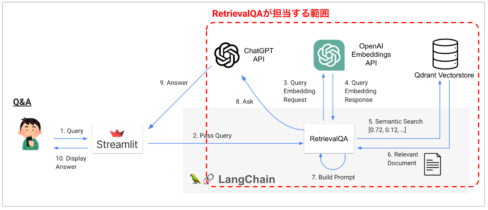
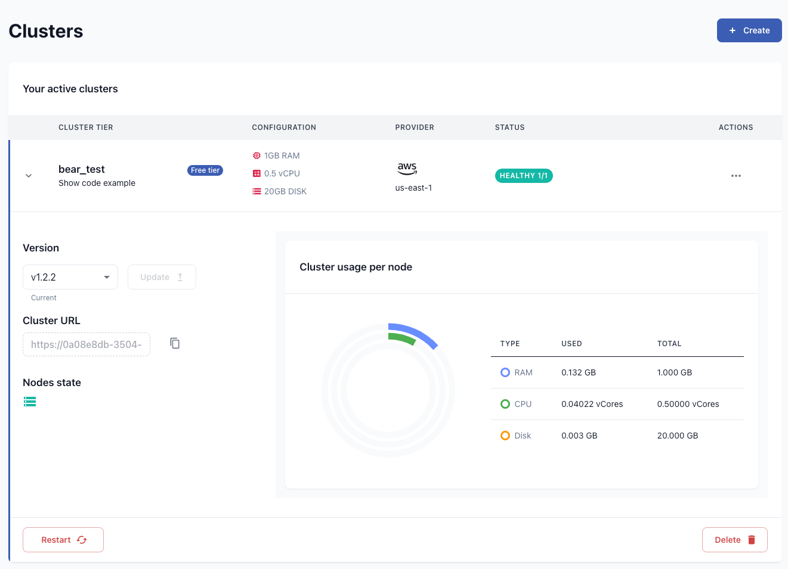

# PDF に質問しよう (後編: RetrievalQA)

## この章で学ぶこと

- PDF に質問する仕組みを学ぶ (LangChain RetrievalQA)
- ベクトル DB をクラウド上に作成する方法を学ぶ

## PDF に質問するまでの流れ

今回は"質問応答"の部分を作っていきます


1. ユーザーが Streamlit に質問(Query)を書く。
1. Streamlit が質問を LangChain に渡す
1. 質問を OpenAI Embeddings API に渡す
1. Embedding になった質問が返ってくる
1. 4.で得た Embedding をもとにベクトル DB から似た文書(チャンク)を検索する (関連文脈をセマンティック検索しているのと同義)
1. ベクトル DB から似た文書が返ってくる
1. 6.で得た内容を Prompt に代入して Prompt を作成
1. ChatGPT API に Prompt を投げて質問を行う
1. ChatGPT API が回答を返してくる
1. Streamlit で回答を表示する

## 質問応答の実現

それでは早速、ベクトル DB に保存した PDF を利用して、Q&A を実現するコードを実装していきましょう。

以下のような 3 つのステップから構成されていますが、load_qdrant は前の章で作ったものを丸ごと流用できるため、実質的には 2 ステップしかありません。

1. load_qdrant 関数： ベクトル DB を操作するクライアントを準備する(前章で作ったものと同じ)
1. build_qa_model 関数: ベクトル DB を利用して質問応答を行う LangChain の機能(RetrievalQA)を呼び出す
1. ask 関数: RetrievalQA を利用して質問応答を実行する

```py
from qdrant_client import QdrantClient
from langchain.vectorstores import Qdrant
from langchain.embeddings.openai import OpenAIEmbeddings

QDRANT_PATH = "./local_qdrant"
COLLECTION_NAME　= "my_collection"

def load_qdrant():
    """ 前章で作ったものと完全に同じなので省略 """
    client = QdrantClient　...

def build_qa_model(llm):
    qdrant = load_qdrant()
    retriever = qdrant.as_retriever(
        # "mmr",  "similarity_score_threshold" などもある
        search_type="similarity",
	# 文書を何個取得するか (default: 4)
	search_kwargs={"k":10}
    )
    return RetrievalQA.from_chain_type(
        llm=llm,
        chain_type="stuff",
        retriever=retriever,
        return_source_documents=True,
        verbose=True
    )

def ask(qa, query):
    with get_openai_callback() as cb:
        answer = qa.run(query)

    return answer, cb.total_cost

# llm = ChatOpenAI(model_name="gpt-3.5-turbo") など
qa = build_qa_model(llm)
if qa:
    with st.spinner("ChatGPT is typing ..."):
        answer, cost = ask(qa, query)
```

## RetrievalQA とは

上記のコード内では RetrievalQA という機能が中心的な役割を果たしています。これはどのようなものでしょうか？

### RetrievalQA の基本動作

RetrievalQA は以下の動作によって、追加の文脈情報を活かした質問応答を実現しています。



- まず、ユーザーからの質問に関係するテキスト(文脈情報)を DB から取得する。

  - 多くの場合、セマンティック検索を利用して DB から文脈情報を取得する。
  - 具体的には以下の流れを行う
    - ユーザーからの質問を Embedding 化する (図中: 3/4)
    - その Embedding に近いテキストをベクトル DB で検索し取得する (図中: 5/6)
      - 検索方法は retriever のオプションで調整することが可能

- Prompt に取得した文脈情報を埋め込んで Prompt を生成。 (図中: 7)

  - chain_type: 回答の生成方法を調整
    - 要約の時と同様に map_reduce などに設定すると非常に長い文脈も考慮できる
    - map_reranker というものもあり、分割して質問した上で、一番それっぽい回答を回答にする、というものもあるそうですが、大して精度が高くないという評判を聞いたことがあるので、詳しく説明しません。
  - return_source_documents: True なら参照した文脈情報をレスポンスに含める

- ChatGPT API の呼び出し、回答の取得。 (図中: 8/9)

上記の作業を以下の少ない行数で実行が可能です、驚異的ですね。

```py
def build_qa_model(llm):
    qdrant = load_qdrant()
    retriever = qdrant.as_retriever(
        # "mmr",  "similarity_score_threshold" などもある
        search_type="similarity",
	# 文書を何個取得するか (default: 4)
	search_kwargs={"k":10}
    )
    return RetrievalQA.from_chain_type(
        llm=llm,
        chain_type="stuff",
        retriever=retriever,
	# 参考にした文書もレスポンスに含める
        return_source_documents=True,
        verbose=True
    )

query = "トヨタの最新の決算内容について簡単に教えて"
qa = build_qa_model(llm)
answer = qa.run(query)
```

### retriever のオプションによる検索方法の調整

RetrievalQA にはベクトル DB への検索を実行する retriever というものを設定します。

以下 2 つのオプションにより、検索方法を調整することが可能です。利用するベクトル DB によって、利用可能なオプションが少しずつ異なるため、必要に応じて仕様を確認されることをおすすめします。

#### 1. search_type: 検索方法の調整

| value                      | 説明                                                                                                                                                                                                                   |
| :------------------------- | :--------------------------------------------------------------------------------------------------------------------------------------------------------------------------------------------------------------------- |
| similarity<br>(default)    | ベクトル DB を構築したときに設定した距離関数で類似度を計算                                                                                                                                                             |
| mmr                        | Maximum Marginal Relevance を利用し、なるべく回答が重複しないようにする。レスポンスの中で似ている文脈情報があれば適度に間引かれる。<br>(詳しくは Maximum Marginal Relevance を Google や ChatGPT 等で検索してください) |
| similarity_score_threshold | 閾値を設定し、類似度がそれ未満の場合は利用しない<br> 後述の similarity_score_threshold と併用する                                                                                                                      |

#### 2. 各種パラメータ設定: search_kwargs

| value           | 説明                                                                                                                                                                          |
| :-------------- | :---------------------------------------------------------------------------------------------------------------------------------------------------------------------------- |
| k               | 検索にヒットする文書の数を指定する。<br>(default: 4 / 本書では 10 に設定)                                                                                                     |
| score_threshold | search_type で similarity_score_threshold を選択したときに使用する。類似度の閾値を設定する。                                                                                  |
| filter          | Qdrant ではベクトル DB を作成する際に各レコードに metadata を設定しておけば、それを利用して取得する文脈が調整可能。<br>(その他のベクトル DB での対応状況は別途ご確認ください) |

```py
# similarity_score_threshold を利用する際の例
retriever = db.as_retriever(
    search_type="similarity_score_threshold",
    search_kwargs={"score_threshold": .5}
)

# filterを利用して取得する文脈を制限する例
retriever = db.as_retriever(
    search_kwargs={
        "filter": {"company": "toyota"}
    }
)
```

#### RetrievalQA 内部で利用されている Prompt

RetrievalQA では、以下の Prompt の中に取得した文脈情報を埋め込んでいます。

```py
# https://github.com/hwchase17/langchain/blob/master/langchain/chains/question_answering/stuff_prompt.py
prompt_template = """Use the following pieces of context to answer the question at the end.
If you don't know the answer, just say that you don't know,
don't try to make up an answer.

{context}

Question: {question}
Helpful Answer:"""
```

Youtube 動画の要約を行った章では、この Prompt を意図的に変更していました。Youtube では多くの transcript が英語で提供されています。その場合は Prompt の言語が完全に英語になってしまうので、英語で回答が返ってくることが多いです。よって、Prompt の最後に「日本語で答えて」と明記しないと日本語ではなかなか答えてくれません。

この章のサンプルアプリでは日本語の PDF を入力するので、その文章が context として与えられます。同時に日本語で書いた質問も question として埋め込まれるため、Prompt 全体が日本語優位となり、特に工夫をしなくても日本語で回答を得られるはずです。

質問の回答方法をチューニングしたり、確実に日本語で返答をさせたい場合はこちらで Prompt を設定してあげるのも有効な手段となります。[Retrieval QA の公式ドキュメント](https://python.langchain.com/docs/modules/chains/popular/vector_db_qa#custom-prompts)に記載のコードを参考までに置いておきます。

```py
# 本書の説明に合わせて少し変更しています
from langchain.prompts import PromptTemplate

prompt_template = """Use the following pieces of context ... Answer in Italian:"""
PROMPT = PromptTemplate(
    template=prompt_template, input_variables=["context", "question"]
)
qa = RetrievalQA.from_chain_type(
    llm=llm,
    chain_type="stuff",
    retriever=qdrant.as_retriever(),
    # ここで指定する
    chain_type_kwargs={"prompt": PROMPT}
)

query = "What did the president say about Ketanji Brown Jackson"
qa.run(query)

" Il presidente ha detto che Ketanji Brown Jackson è una delle menti legali più importanti del paese, che continuerà l'eccellenza di Justice Breyer e che ha ricevuto un ampio sostegno, da Fraternal Order of Police a ex giudici nominati da democratici e repubblicani."
```

#### 参考: ConversationalRetrievalChain

「返ってきた質問に対してさらに質問できたりしないの？」と思われた方もいらっしゃるでしょう。LangChain のすごいところは、パッと思いつくようなニーズに対して何かしらの解決策が実装されていることが多いというところです。(非常に簡素な機能であることも多いのが玉に瑕ですが…)

この場合、[ConversationalRetrievalChain](https://python.langchain.com/docs/modules/chains/popular/chat_vector_db) という機能を利用すれば実現可能です。興味のある方は是非調べていただいて、挑戦していただけると幸いです。(こちらの機能については後日追記するかもしれません)

#### 参考: load_qa_chain

load_qa_chain を用いて質問応答を作っているパターンもたまに見かけます。これはなんでしょうか？

load_qa_chain は質問応答を行うための最も一般的なインターフェースを提供しており、RetrievalQA の内部でも使用されています。しかし、Retrieval の機能がついていない(※)ため、与えられたドキュメント全体を使用して質問応答する必要があります。(※ 必要に応じて関連する文脈だけを取ってくることができない)

例えば、ある PDF ファイルが 50 ページ以上ある場合、その全てのテキストを使用します。この方法では token の使用量が多く無駄な上に、ファイルが大きい場合には Prompt の token 制限を超えてしまうこともあります。そのため、本書では load_qa_chain は利用せず、最初から RetrievalQA を利用して質問応答アプリを作成しました。

## ベクトル DB の共有 (Qdrant Cloud)

ここまでで、ローカル環境で動く質問応答アプリが完成しました。GIF 画像のようにきちんと動作したでしょうか？ローカル環境にベクトル DB を構築すると、他の人と共有することができません。(まぁ厳密には SQLite のファイルを渡したりとかで対応は可能ですが…。)

そこで、クラウド上にベクトル DB を構築してみましょう。これが本書最後のトピックとなります。

まずは [Qdrant Cloud](https://cloud.qdrant.io/) からアカウントを開設しましょう。途中で API_KEY が出現するのでメモっておくのを忘れないでください。

最後まで進むと以下のようにクラスターが立ち上がるはずです。トイユースであれば Free Tier で十分です。画面に表示されている URL をコピーしてメモっておきましょう。



最後に、API_KEY と URL を以下のように load_qdrant 関数にセットすれば、クラウドサービス上のベクトル DB を利用するようになります。この部分以外のコードの変更は不要なので簡単ですね！

```py
def load_qdrant():
    # 以前こう書いていたところ: client = QdrantClient(path=QDRANT_PATH)
    # url, api_key は Qdrant Cloud から取得する
    client = QdrantClient(
        url="https://hogehogehogehoge.us-east-1-0.aws.cloud.qdrant.io:6333",
        api_key="api-key-hogehogehogehoge"
    )
    ・・・
```

釈迦に説法かもしれませんが、一点だけ注意点です。Github に API_KEY を Push しないように気をつけてください。Streamlit Cloud でこのアプリをデプロイする際は、環境変数から API_KEY や URL を取得されるのが無難かと思います。

```py
def load_qdrant():
    client = QdrantClient(
        url=os.environment['QDRANT_CLOUD_ENDPOINT'],
        api_key=os.environment['QDRANT_CLOUD_API_KEY']
    )
    ・・・
```

## うまく回答してくれない場合

実際に AI アプリを作って動かすとお気づきになるかもしれませんが、結構な確率で質問応答がうまくいきません。ここまで解説しておいて今更言うの？と思われるかもしれませんが、実は ChatGPT に関連する文脈の情報を与えて質問応答するのは容易なことではありません。

まず、[こちらの記事](https://tech-blog.abeja.asia/entry/retrieval-and-llm-20230703)にも詳しいですが 質問に対する適切な文脈情報の取得 は、簡単に見えて実は非常に奥の深い問題です。この記事に書かれている問題の他にも、「カビゴンに似ているポケモンは？」という質問に対してはカビゴンの情報ばかりをとってきてしまい、なかなか質問に適切な回答を生成するのは難しいはずです。

また、ベクトル DB の作成も容易ではありません。例えば会社内のドキュメントを検索するシステムを作るとしましょう。ある社内規定が変更された際、元の文章の削除が適切に行われなかった場合、質問に対して二つの相反する文脈情報がベクトル DB に存在してしまいます。

その結果、相反する情報が ChatGPT に渡されてしまい、ChatGPT が正確に回答するのが困難になります。例えば「リモートワークって可能なの？」という質問に対しては、コロナ前後で全く結果が違う企業も多いはずです。

ベクトル DB を構築する際に timestamp を付与しておき ChatGPT に適切に考えてもらう、といった工夫で解決することも可能でしょうが、そのようなヒューリスティックな解決策を積み重ねるのはなかなか大変です。

うまくいかない場合は「そもそも関連する文脈を取得可能なのか？」「取得する関連文脈は正しいものなのか？」といったことをまずは考えられるのが良いかと思います。

後者に関しては、return_source_documents=True とすれば ChatGPT が参照した文脈を見ることも可能なので、検討してみてください。

'23/7 時点の公開情報では、OpenAI は 2023 年末までに ChatGPT で利用するモデルのファインチューニングを可能にすると公言しています。個人的には、その辺りの技術の適切な利用法を検討していきたいと考えています。

## 動かしてみる

```sh
streamlit run 10_sample_app.py
```
